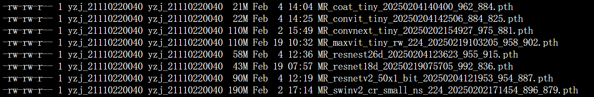
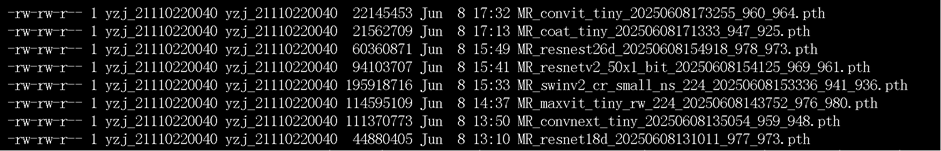
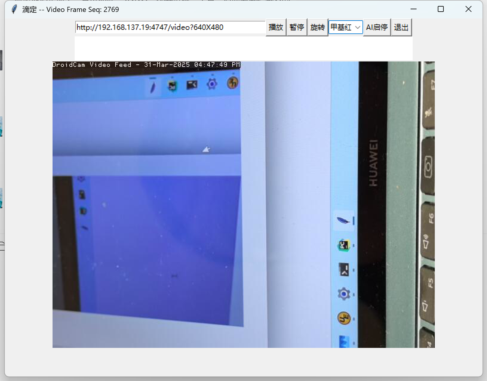

# 一、训练流程  
1） 前期拍摄聚焦于反应容器(烧杯或锥形瓶)中的滴定状态变化过程的视频，可以多个手机多角度对多次实验的拍摄。  
2） 对每个视频进行视频帧抽取并保存成图片(如每隔10帧抽取1帧)用于图像识别训练。  
3） 对图片中的滴定状态进行人工标注 -- 状态按需(一般可分4个状态：初始、近终点、终点、过量)  
注：标注时，应选择高质量图片，对于特别不易区分状态的图片应忽略。  
4） 对标注好的图片进行模型训练，模型可以直接使用开源的视觉分类模型。  
注：可以直接加载预训练模型进行迁移训练。  
5） 训练结果如下图  
  
  
注1：图中模型文件名格式：{模型前缀_生成日期_验证集准确率_测试集准确率.pth}，明显第二次的准确率高很多(使用自动滴定仪滴定录制并生成训练数据)。  
注2: 使用自动电位滴定仪滴定基本流程：录制视频->OCR识别解出帧的图片与对应PH值-> 人工定义状态与PH值范围对应关系(根据仪器的PH值变化曲线滴定体积等并结合滴定图像)->转换PH值为状态标签   
注3: 自动滴定省时高效且高质量数据带来更高准确率。人工滴定过程，不同角度、光线的拍摄视频中的抽取出的图片，不同人识别打标时会有不一致。

# 二、运行流程  
1）手机安装DroidCam (APP目录里DroidCamX-v6.9.3)  

2）保证手机与笔记本在同一个局域网   
法一：笔记本开WIFI热点，让手机直接连接到该WIFI热点上。此时笔记本热点时手机ip一般为192.168.137.XX。   
法二：两者都连接到同一个WIFI路由器上。  

3) 手机打开DroidCam, 并对准滴定实验的烧杯。  
也可以在PC上用视频播放软件打开'./data/MR/VID_20250114_122658.mp4', 然后用DroidCam手机端实时拍摄此视频（把此视频当作实验），看结果

4) 笔记本上python运行main。  
4.1 在main里连接Droidcam的流服务地址(该地址在DroidCam里会有显示，如"<http://192.168.137.99:4747/video?640X480>")，  
4.2 播放(开始接收视频)，  
4.3 AI启停(开始自动判断滴定状态)  
注：DroidCam提供在浏览器里进行控制管理(管理URL如<http://192.168.137.99:4747/>)

# 三、程序说明
1) "main.py": 滴定时自动识别状态主程序。  
  
2) "titration_dl.ipynb": 模型训练程序(Jupyter notebook)。  
3) "tools/*.py"
用于"从视频中抽取图片"、"分类所需的labels"(打标)。    

# 四、其它说明
1) 项目中的模型说明参见"./outputs/checked/readme.txt"。  
2) 部分原始视频
部分甲基红手动滴定视频见 <https://pan.baidu.com/s/1LcWHjo6_935VxkJuRnvlCg?pwd=t6yg> 提取码: t6yg  
部分甲基红自动滴定视频见 <https://pan.baidu.com/s/13zdyUjJn7UOU4EV6pfhzXQ?pwd=pv2y> 提取码: pv2y

# 五、已优化
只使用一个手机APP完成上述"服务器端 + 手机DroidCamp"功能 --  拍摄并自动识别滴定状态。参见项目<https://github.com/Vescrity/PYTVDroid>。

# 六、可优化
1) 如果使用注射器，主程序可以根据滴定状态控制注射器的进样速度及启停。  
2) 如果使用滴定管，可以参考《Computer Vision in Chemistry: Automatic Titration》通过计算机视觉方式获取滴定读数。  

