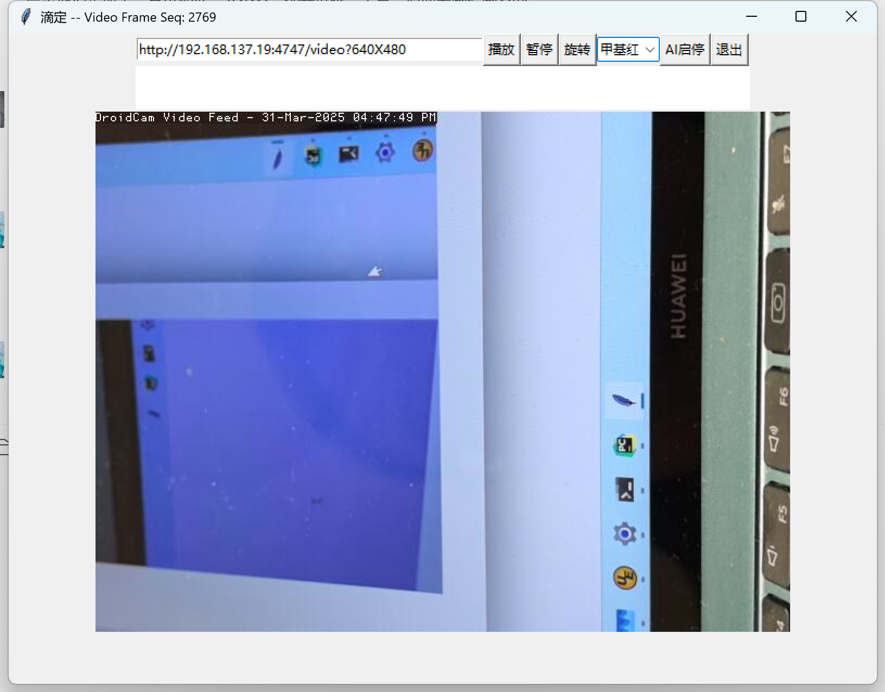

# 一、训练流程  
1） 前期拍摄聚焦于反应容器(烧杯或锥形瓶)中的滴定状态变化过程的视频，可以多个手机多角度对多次实验的拍摄。  
2） 对每个视频进行视频帧抽取并保存成图片(如每隔10帧抽取1帧)用于图像识别训练。  
3） 对图片中的滴定状态进行人工标注 -- 状态按需(一般可分4个状态：初始、近终点、终点、过量)  
注：标注时，应选择高质量图片，对于特别不易区分状态的图片应忽略。  
4） 对标注好的图片进行模型训练，模型可以直接使用开源的视觉分类模型。  
注：可以直接加载预训练模型进行迁移训练。  
5） 训练结果如下图  

# 二、运行流程  
1）手机安装DroidCam (APP目录里DroidCamX-v6.9.3)  

2）笔记本开WIFI热点，让手机直接连接到该WIFI热点上。    
主要是保证手机与笔记本在同一个局域网，笔记本热点时手机ip一般为192.168.137.99。 也可让笔记本与手机连接到同一WIFI。

3）手机对准滴定实验的烧杯。  
也可以在PC上用视频播放软件打开./data/MR/VID_20250114_122658.mp4, 然后用DroidCam手机端实时拍摄此视频（把此视频当作实验），看结果

3）手机打开DroidCam，笔记本上python运行main。  
3.1 在main里连接Droidcam的流服务地址(该地址在DroidCam里会有显示，如"http://192.168.137.99:4747/video?640X480")，  
3.2 播放(开始接收视频)，  
3.3 AI启停(开始自动判断滴定状态)  
注：DroidCam提供在浏览器里进行控制管理(管理URL如http://192.168.137.99:4747/)

# 三、其它(TBD)
1） 如果使用注射器，主程序可以根据滴定状态控制注射器的进样速度及启停。
2） 如果使用滴定管，可以参考《Computer Vision in Chemistry: Automatic Titration》通过计算机视觉方式获取滴定读数。

# 四、程序说明
"main.py": 滴定时自动识别状态主程序。    
"titration_dl.ipynb": 模型训练程序。  
部分甲基红滴定视频见 https://pan.baidu.com/s/1LcWHjo6_935VxkJuRnvlCg?pwd=t6yg 提取码: t6yg